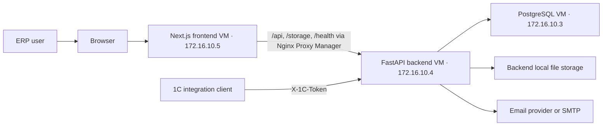
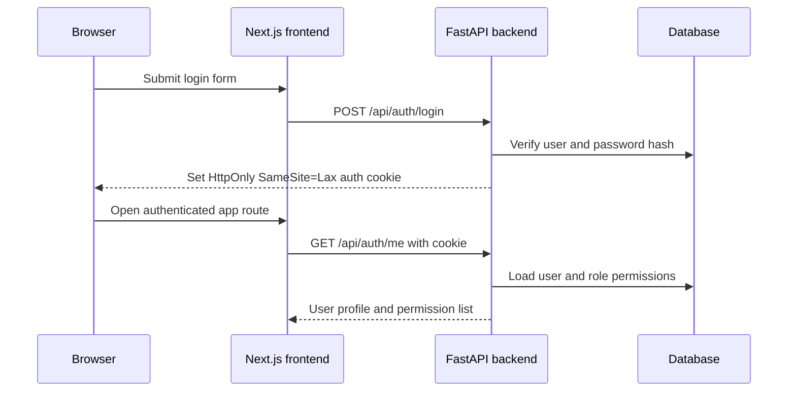
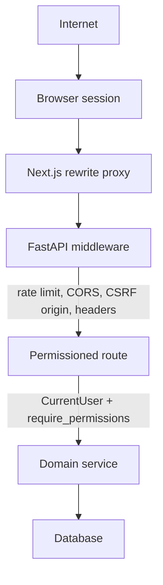
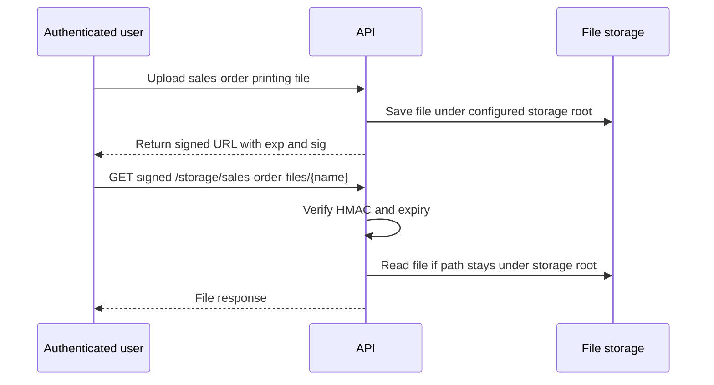
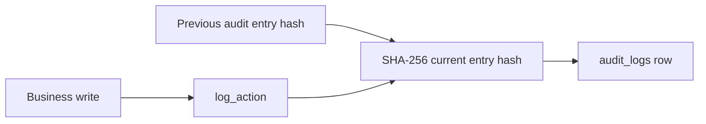

# Milana ERP Architecture

This document captures the current production shape of the system. Update it whenever deployment topology, authentication, storage, or trust boundaries change.

## System Context

## Authentication Flow

Machine clients use `POST /api/auth/token` and send `Authorization: Bearer <token>`. Browser login does not expose the bearer token to JavaScript.

## Request Trust Boundaries

## Sensitive File Access

Model files require an authenticated session. Sales-order printing attachments use short-lived signed URLs because browser image/file rendering cannot attach authorization headers.

## Audit Logging

Audit rows store `prev_hash` and `entry_hash`. This provides tamper evidence for changed or deleted historical rows when compared against an exported snapshot or backup.

## Current Runtime Components

- Frontend: Next.js App Router on the production frontend VM.
- Backend: FastAPI, SQLAlchemy, Alembic, deployed as a release-tagged Docker service on the production backend VM.
- The canonical topology and release procedure are defined in `DEPLOYMENT.md`.
- Database: PostgreSQL in production, SQLite only for tests.
- Auth: HttpOnly cookie for browser sessions; bearer token endpoint for machine clients.
- Authorization: role permissions stored as JSON strings with `*` as superadmin wildcard.
- Files: generated barcodes/model files/sales-order attachments in backend storage paths.
- CI: backend tests, Bandit, pip-audit, Ruff, frontend npm audit, lint, typecheck, and build.
