# Milana ERP business requirements and workflow

Version 1 • 21 September 2026 • English • Prepared from the verified production source and repository

This manual explains how Milana ERP supports the garment factory from customer demand to shipment, how departments hand work to one another, and what evidence must exist before quantities become stock or pay. It is for department managers, operators, product owners, designers and developers. Use the companion page and button reference when you need an exact screen or control.

## 1 Scope and evidence

The production source on both application VMs was checked on 21 September 2026. Both resolve to release `20260920_030043`; both source manifests validate and have SHA-256 `6e0fe7e13abf717b544995c5e06a7628636ecd8919236cc89f08117660b391e2`. The documented Git snapshot is `fb3c3d582b0bda9c94cd6a951c432a7a4383820f`. Its application code matches deployed application commit `f78b8b68067521ff0478e3a3b7210b3d4d57d2e9`; only production records and workflow documentation differ. The baseline records database revision `0132_first_grade_singles`. Runtime slot-state files required elevated access and were not read during this documentation task; the deployment record identifies green as active and blue release `20260919_120429` as rollback. No live business transactions were executed for this manual.

Evidence levels used throughout:

- **Current source:** behavior read from the verified application source or its tests; not a claim that every branch was clicked in production.
- **Recorded deployment:** behavior and validation described in the latest dated entries of `docs/PROJECT_CONTEXT.md`.
- **Business requirement:** a rule the product must satisfy. A requirement is not by itself proof of complete backend enforcement.
- **Future or unresolved:** not available or not demonstrated; never represent it as a working control in a prototype.

The legacy `C:\ERP` checkout is older, dirty and missing its baseline manifest. It was preserved. This package was authored in a clean worktree from fetched `origin/main`. Older context sections conflict with newer changes: the September 18 removal of automatic failed-piece replacement supersedes older replacement instructions; the September 20 First Grade implementation supersedes its original proposal. Apply dated changes before historical summaries.

Coverage includes all 102 `page.tsx` route templates, shared navigation, operational modules, administration, HR, integrations and reporting. This is a source-based functional specification and navigation model, not a pixel-exact screen recreation, a fresh security audit, a database reconciliation or a claim that every configured role has been exercised live.

## 2 Business objectives

1. Translate demand into an executable plan by model, variant, color, size, quantity, material and factory.
2. Preserve a traceable chain from demand and material receipts through production batches, bundles, accepted output, packages, warehouse receipts and shipment.
3. Prevent duplicate allocation, unsupported stock, accidental cross-factory work and untraceable corrections.
4. Give each department a clear incoming queue, an action to perform and evidence required by the receiving department.
5. Support scanner, tablet, phone and print workflows in English, Russian and Uzbek.
6. Let managers compare demand, plans, actual output, defects, stock, labor and delivery progress using business identifiers.

## 3 Actors and responsibility boundaries

Role names describe business responsibilities. Effective permissions, configured access rules, department and factory determine actual access; this table does not grant permissions.

| Actor | Main responsibility | Main workspaces | Handoff |
|---|---|---|---|
| Sales | Customer, commercial demand, net price, order and available-stock sales | Customers, Sales Orders, Price Requests, Order History | Planning; warehouse fulfillment |
| Modeling | Model family, variants, images, BOM, brand and collection | Models, Brands, Collections | Sales, costing, Planning |
| Planning | Materials, quantities, batches, deadlines and factory routing | Planning, Branded Stock, Production Orders, Forecasting | Cutting and purchasing |
| Purchasing requester and approver | Material request review and supplier order | Purchasing | Receiving |
| Material warehouse | Receipt, batches, rolls, reservations and issue evidence | Inventory, Receiving, Fabric Scans, Eco Transfers | Cutting |
| Cutting | Passport, material usage, actual cut quantities, bundles and labels | CUT or ECT floor, Passports, Bundle Inventory | Printing or Sewing |
| Printing | Collect required print work, record output and pass bundles onward | PRT floor and Printing Scan | Sewing |
| Sewing manager and operator | Receive correct-factory work, assign line, record good output and loss | Sewing Flows, factory floor, Sewing Scan | Packaging |
| Packaging | Receive Sewing, record packed output, create valid packages or singles | Packaging floor, Queue, Receive, Packages | Finished Goods |
| Finished-goods warehouse | Verify receipt, locate and reserve stock, pick and scan shipments | Finished Goods, Warehouse Stock, Map, Package Scan, Shipments | Delivery and Sales |
| HR and attendance | Employee identity, organization, recruitment, documents and time evidence | HR workspace, Attendance | Payroll and management |
| Payroll | Issued-operation labels, employee work evidence, rates, reversal and payment | Process QR, Scan, Summary, QR Control, Reports | Finance and employees |
| Finance | Cost completion, invoices, payments and 1C coordination | Price Calculation, Finance | Sales and management |
| Management | Traceability, exceptions, performance, tasks and notifications | Dashboard, Processes, Traceability, Forecasting | Responsible departments |
| Administrator | Accounts, explicit access, departments, audit and guarded data tools | Administration | All modules under authorization |

## 4 Core business objects

| Object | Meaning and required relationship |
|---|---|
| Customer and sales order | Commercial demand, delivery expectations and net prices; order lines identify the required product and quantities |
| Model and variant | Product family and exact appearance/material identity; variant image must be consistent across workflow screens |
| BOM and material item | Material requirements associated with a product; an item is not the same as a received physical stock batch |
| Stock batch and roll | Supplier/receipt-specific stock, quantity, QC and images; reservation and consumption refer to the correct batch |
| Purchase request and purchase order | Approval need and supplier commitment; receiving creates evidence-backed material stock |
| Production order and batch | Approved execution plan and its separately traceable production portions |
| Work order | Department-stage assignment linked to its production order and, where applicable, batch |
| Cutting passport | Saved cutting/material/size evidence used to avoid a second, contradictory material debit |
| Bundle | Labeled cut goods handed to Printing or Sewing; it is not finished-goods stock |
| Sewing assignment and output | Factory and internal line assignment, accepted quantity and defects/loss |
| Packaging record and package | Evidence of packed output and a specific QR/barcode unit; total allocated packages cannot exceed valid output |
| Print run | Group of issued package labels; supported receipt may use any member QR to identify the run |
| Finished-goods stock | Received package-backed balance, availability and reservation; being sewn or labeled alone is insufficient |
| First Grade single | One quality-approved piece of one exact size/color and one QR, classified separately from complete packs |
| Shipment and scan line | Dispatch commitment and exact physical packages assigned to it, with traceable pre-dispatch return |
| Paid-operation label and payroll record | Issued work identity and employee earning evidence; duplicate scans must not create duplicate earning |
| Daily Sewing Report | Reporting ledger with line/date/work sections; it does not automatically advance production |
| Audit event | Actor, action, affected entity and change history; historical chain integrity remains an open concern |

A common trace is `customer → sales order → production order → production batch → work order → bundle → accepted Sewing → packaging record → package → warehouse receipt → reservation → shipment`. Branded-stock production can begin without customer demand. Usluga retains customer ownership rather than entering unrestricted sale stock.

## 5 Main production lifecycle

```mermaid
flowchart LR
  SO[Sales order] --> PL[Planning]
  BS[Branded stock demand] --> PL
  US[Usluga customer order] --> PL
  PL --> PO[Production order and factory routing]
  PO --> CUT[Cutting starts automatically]
  INV[Received material and reservations] --> CUT
  CUT --> B[Bundles and QR labels]
  B --> Q{Printing required?}
  Q -->|Yes| PR[Printing]
  Q -->|No| SEW[Sewing receipt and line assignment]
  PR --> SEW
  SEW --> GOOD[Accepted good output by batch and size]
  SEW --> LOSS[Defects and processed loss]
  GOOD --> PKG[Packaging receipt and allocation]
  PKG --> PACK[Standard packages]
  PKG --> SINGLE[Eligible First Grade singles]
  PACK --> REC[Warehouse receipt]
  SINGLE --> REC
  REC --> STOCK[Available and reserved finished goods]
  STOCK --> SHIP[Pick scan and dispatch]
  SHIP --> DEL[Delivery record]
```

The diagram describes departmental handoffs, not a claim that every arrow is a page-opening button. For example, saving accepted Sewing output changes business state while the operator may stay on the same page. `NAVIGATION_GUIDE.md` describes that distinction.

### WF01 Customer demand and sales

**Trigger:** a customer asks for garments or selects available stock. **Owner:** Sales. **Entry:** `/customers`, `/sales-orders`, `/sales-orders/new`; single-piece stock sales use `/sales-orders/first-grade`.

1. Select or maintain the customer and the correct model/variant. Preserve business names, size/color quantities, dates and net prices.
2. Use Price Requests if costing is incomplete. A quotation/cost request is distinct from a production order.
3. Create and review the sales order. Open its business order number to reach `/sales-orders/[id]`.
4. Hand production demand to Planning, or reserve eligible received finished goods through the relevant ready-stock flow.
5. Follow fulfillment through the order detail and history. Do not count an unreceived package as saleable stock.

**Output:** a traceable commercial order and either production demand or validated stock reservation. **Exception:** unavailable quantity, missing product identity or incompatible stock classification must be resolved before allocation. **Acceptance:** changing commercial data must not silently mint stock or skip the required physical handoff.

### WF02 Price calculation across departments

**Trigger:** Sales requires a calculated price. **Entry:** `/sales/price-requests`. The shared request appears in `/cutting/price-calculation`, `/purchasing/price-calculation`, `/inventory/accessory-pricing` and `/finance/price-calculation` according to permission and configured audience.

Sales creates the request; Cutting supplies its costing contribution; Purchasing supplies material costs; the accessories role supplies accessory costs; Finance completes financial costing. Department updates operate on the same request. Current costing logic uses the Cutting, Purchasing and accessories completion states to determine readiness. A Save control persists the department contribution; it does not necessarily open the next department's page. Each participant enters their own workspace and sees their eligible requests.

**Output:** a completed cost request available for commercial use. **Acceptance:** contributors cannot treat missing upstream costs as a finished calculation; audience-specific access remains in place. See `backend/app/services/price_calculation.py` and the price-calculation workflow regression tests.

### WF03 Planning and production creation

**Trigger:** approved demand or an internal branded-stock requirement. **Entry:** `/planning`, `/planning/branded-stock`, `/production-orders`.

1. Review demand and stock/material availability. Select the exact product, sizes, quantities and deadline.
2. Select Cutting department and Sewing factory. Sewing factory is Milana `MIL`, Besttex `BST` or Eco Cotton `ECO`; it is distinct from the internal sewing line chosen later.
3. Allocate appropriate materials and reservations, request missing materials through Purchasing, and preserve the sales/branded/Usluga origin.
4. Create production. This starts Cutting automatically and creates the applicable downstream work; optional Printing is skipped when not needed.
5. Open the production number to review its detail, stage progress, material links and batch evidence.

**Output:** a production order and department work queues. **Exceptions:** missing route, material evidence or incompatible quantities require correction. A waiting factory route can be changed only before assignment/receipt/work makes it unsafe; inspect the current guarded routing action rather than editing several records independently. **Acceptance:** creating one production order must not create two competing demand allocations or silently route customer-owned output into free stock.

### WF04 Purchasing and material receipt

**Trigger:** an identified material/accessory shortage. **Entry:** `/purchasing`, then `/purchasing/receiving`.

Current service status sets allow a request to begin as `draft` or `pending_approval`; these states can be approved. A request becomes `approved`, can be rejected where permitted, and converts to an order only from approved state. Conversion records `converted`. Purchase orders are created as `draft` or `sent`; receiving accepts the service's eligible states `sent`, `approved` or `partially_received`. Receipt can leave an order partial or close it as received.

Record supplier and exact item, receipt quantity, warehouse, internal batch identity, roll weights where applicable, and QC evidence. Receiving updates batches/movements, rather than merely marking an order text field. Images uploaded for a receipt or batch must remain scoped to the correct physical batch. Repeated receipt submission must not be treated as authority to duplicate a physical delivery.

**Output:** evidence-backed material/accessory stock. **Acceptance:** quantity, unit, supplier and batch remain traceable to the purchasing/receipt source; partial deliveries preserve the outstanding balance.

### WF05 Material inventory and fabric handling

**Entry:** `/inventory?group=materials` or `group=accessories`, `/inventory/receive`, `/inventory/batches`, `/inventory/archive`, `/inventory/master-data`, `/inventory/cutting-fabric-usage`, `/fabric-scans`, `/eco-fabric-transfers`.

Receive, search and review physical batches; reserve appropriate quantities for production; issue/consume against the exact approved source. Keep kilograms, meters, rolls and pieces distinct wherever those units are used. Available quantity must consider existing reservations and usage. Fully consumed material can be archived without deleting its history. Linked, used or reserved records require guarded correction rather than unrestricted deletion.

Batch image editing affects only that exact batch. It must not overwrite the model/variant identity image. Material master data, supplier folders and receipt details support lookup; they do not replace stock movements.

Eco fabric transfers record sent rolls and their returned state. History distinguishes all returned, partly returned and still at Eco Cotton; its dispatch PDF lists sent items. Do not debit/credit both the scan and an independent manual entry for the same movement. Fabric Scans is a camera/scanner-oriented entry surface and its sidebar link deliberately performs a full navigation.

**Acceptance:** inventory report/search totals and batch details agree for the same filters; transfers, returns and consumption preserve source evidence and quantity conservation.

### WF06 Cutting and passports

**Entry:** `/departments/CUT` or `/departments/ECT`, `/work-orders/[id]/cutting`, `/cutting-passports`, `/cutting-inventory`, `/bundles`.

1. Select the waiting/active production work by business number and confirm its factory and product.
2. Maintain the cutting passport and its materials, actual quantities and size evidence. For planned-material Cutting, current source consumes from the saved passport through the existing transactional warehouse path. The old duplicate material-usage panel is removed for that path.
3. Record actual cutting output, including shortfall and ordinary extra output. A consumed passport cannot be reused to debit the material again.
4. Create bundle evidence and print QR/barcode labels. Cutting Inventory holds bundles until the next department receives them.
5. Hand bundles to required Printing or directly to Sewing. Keep the batch/product identity intact.

**Output:** cut bundles with real material/output evidence. **Acceptance:** overproduction lifts applicable downstream plans to actual cut quantity; shortfall remains visible. Failed Sewing pieces no longer generate an automatic replacement queue. Ordinary additional Cutting follows the normal evidence and planning rules. Historical replacement records are retained as history.

### WF07 Printing

**Entry:** `/departments/PRT`, `/bundles/scan/printing`, `/work-orders/[id]/printing`.

Required printing work enters the printing queue; current workflow distinguishes pending/collected work from completed work. Collect/receive the correct bundles, record printing work and pass valid output onward. If Printing is not required, the workflow goes directly from Cutting to Sewing without waiting for a nonexistent printing work order.

**Output:** traceable printed bundles ready for Sewing. **Acceptance:** a printing permission must not permit arbitrary completion of other operations; receiving/recording must refer to the correct upstream work. This is a requirement to verify, not a blanket resolution of historical authorization findings.

### WF08 Sewing receipt and production

**Entry:** `/bundles/scan/sewing?factory=MIL|BST|ECO`, `/sewing/flows?factory=...`, appropriate factory floor, `/work-orders/[id]/sewing`.

Scan and receive eligible upstream bundles in the correct factory, then assign internal line/work as permitted. The factory choice from Planning must remain separate from line assignment. Show production number, model, variant and cutting/passport identity to the operator. Record actual accepted good quantity and failed/rejected quantity with appropriate evidence. Per-size accepted output is essential for later First Grade allocation.

Defects/loss remain visible and count as processed loss for completion rules; they are never added to good stock. The current implementation does not generate failed-piece replacement demand, waiting replacement banners or replacement completion controls. Corrections must respect downstream receipt/allocation links and use the existing correction flow.

**Output:** accepted Sewing evidence available to Packaging and separate defect/loss history. **Acceptance:** cross-factory scans and incompatible assignment are rejected; duplicate receiving cannot create another physical bundle; accepted and failed output are not conflated.

### WF09 Daily Sewing Report

**Entry:** `/sewing/daily-report?factory=...`. Choose date and line, select active work when available, or enter a manual identity under the supported mode. Each work section records sewn output and defects; two-part garments can record top and bottom separately. Preserve model/variant and Kroy/passport information when linked.

Manual identity must not inherit an unrelated selected model image, work order, assignment, production order or batch. The report supports its configured section limit; it is a reporting ledger and saving it does not by itself receive bundles, complete a work order or create warehouse stock. Export and print are output actions, not navigation to another operational page.

**Output:** date/line reporting rows and summaries. **Acceptance:** editing/exporting report sections retains their manual or linked identity and does not double-count production output.

### WF10 Packaging and complete packs

**Entry:** `/departments/PKG|BPK|ECP`, `/packaging/queue`, `/packaging/receive`, `/work-orders/[id]/packaging`, `/packages`; preserve `packaging_department` query scope.

1. Identify the incoming production number, model, variant and accepted Sewing output. Awaiting Packaging uses the business order reference and thumbnails.
2. Receive eligible Sewing into the correct packaging department and selected production batch.
3. Record actual packed quantity. Create packages only within the selected batch's remaining validated balance.
4. Set supported contents, quantity, weight and labels; respect partial packages. Do not assume every pack everywhere is 60 pieces—use the applicable configured assortment/flow.
5. Print labels and physically hand packages to the warehouse. A4 labels have page numbers and no print-run cover page in the current release.

**Output:** QR-labeled packages backed by packaging evidence. **Acceptance:** total package allocation cannot exceed valid batch/output quantity; repeated requests cannot create duplicate allocation. Label printing must not itself imply warehouse receipt.

### WF11 First Grade singles

**Meaning:** quality-approved pieces that cannot form the required complete assortment, not defective goods. **Entry:** First Grade controls on the Packaging work-order page; separate warehouse stock and sales views.

1. Record accepted Sewing by exact size and verified production color, within one traceable production/batch scope.
2. Allocate complete packs and eligible remaining singles from the same locked quantity budget.
3. Issue one piece, one exact size/color and one QR per First Grade single.
4. Receive its print run into warehouse stock using a supported member QR. Until receipt, it is not saleable stock.
5. Use the separate singles stock tab and **Sell singles** page; select exact sizes and per-piece prices. Normal pack selection excludes singles.

**Example:** an assortment needs one each of 46, 48, 50, 52 and 54. Accepted quantities 10, 10, 8, 10, 10 can support 8 full packs and 8 singles. Forty plus eight remains forty-eight pieces. This is an illustrative calculation, not new production data or a claim that the UI automatically proposes this exact allocation.

Missing per-size evidence, mixed-batch ambiguity and customer-owned/Usluga output block free-stock singles allocation until reconciled. A warehouse quantity correction cannot enlarge a single. Recombining singles into packs and post-delivery commercial returns remain future operations; do not draw them as active prototype buttons. Source: `docs/FIRST_GRADE_SINGLES_WORKFLOW.md` implementation section and current package workflow tests.

### WF12 Finished goods, locations and stocktaking

**Entry:** `/departments/FGS`, `/finished-goods`, `/packages/scan`, `/warehouse-stock`, `/warehouse-map`, `/warehouse-stock/count`.

Receive validated physical packages/print runs. Review availability and reservations separately, place packages in their warehouse locations, and use the warehouse map for supported moves. The warehouse model link opens `/warehouse-stock/models/[id]` in a new browser tab; it lists each package's barcode, sizes, quantity, availability/reservation, weight, location and receipt date with pagination.

Use stocktaking to compare physical evidence with system records, then the guarded reconciliation path. Do not create unsupported balances simply to make the count match. Legacy stock without a current model retains its immutable receipt and original product identity; do not invent a model match.

**Output:** received, locatable, traceable available/reserved stock. **Acceptance:** packages in a shipment, reserved quantities and unsupported source evidence cannot be silently removed or sold twice.

### WF13 Shipment and delivery

**Entry:** `/shipments`; completed/historical review uses `/shipments/history`. Sales-linked and supported manual shipments are distinct cases.

1. Select eligible demand/stock and create the shipment under warehouse permission.
2. Pick and scan exact packages. Review the package contents and required quantities.
3. Before dispatch, use the scanned row's X/Return to inventory action for a mistaken package; it releases the shipment link through the audited removal path.
4. Dispatch only when the required package/evidence checks are satisfied; record delivery after actual shipment under the permitted workflow.
5. Review historical shipments in the separate history route.

A mistaken manual shipment may be deleted only before dispatch. The current guard protects sales-linked, shipped and delivered shipments. Deletion releases scan links atomically, preserves audit history and prevents a replay of the deleted creation request from recreating the shipment. Pre-dispatch package return is not a post-delivery commercial return.

**Acceptance:** mandatory scan coverage, nonempty eligible shipments and shipment-before-delivery are explicit business requirements. Historical scan/delivery bypass findings remain audit items unless the exact current endpoint and regression evidence prove closure.

### WF14 Branded stock, Besttex, Eco Cotton and Usluga

Branded Stock uses `/planning/branded-stock` to initiate stock demand without a customer sales order, then follows the actual production/receipt chain. Besttex uses factory `BST` and packaging `BPK`. Eco Cotton uses Cutting `ECT`, Sewing `ECO` and Packaging `ECP`; its fabric transfer and process tracking remain factory scoped. Milana normally uses Cutting `CUT`, Sewing `MIL` and Packaging `PKG`.

Usluga uses `/usluga`, its separate model catalog and order detail/edit screens. Retain customer ownership, manually supported fabric identity and its approval/handover evidence; do not mix customer goods into unrestricted Milana stock. Shared stage screens may support Usluga work while retaining this origin. Route/query scope is part of the workflow, not a cosmetic filter.

**Acceptance:** changing factory/query parameters cannot broaden server authorization. Factory landing pages derive from effective permission: a Besttex packaging user lands in BPK rather than Sewing; Eco packaging uses ECP. Explicit cross-factory destinations remain guarded.

### WF15 Payroll and process QR

**Entry:** `/process-qr`, `/payroll/scan`, `/payroll/qr-control`, `/payroll`, `/payroll/reports/sewing-production`, `/payroll/reports/order-qr-status`.

Set up supported paid operations/rates and issue the operation labels for the correct work/factory. Select the employee and scan the work label. Current numeric scan handling resolves authoritative issued labels server-side and uses the payroll ledger/idempotency path. Duplicate/replayed scans must resolve the prior record rather than multiply earnings. Returns/reversal and correction must use the dedicated guarded path and keep history.

QR Control and reports explain issued/recorded work and employee production. Summary/payment actions are distinct from scan capture. Factory/department boundaries apply to operation selection and earnings. Work rates and quantities must come from authorized evidence; never trust a freely supplied client amount as sufficient proof.

**Output:** traceable employee work/earnings and payment records where authorized. **Acceptance:** an employee/factory mismatch, duplicate operation label or reversed record cannot be silently converted into another earning. The historic payroll authorization issue is not declared globally closed by this documentation.

### WF16 HR and attendance

**Entry:** `/hr` with Employees, Organization, Positions, Recruitment, Attendance, Calendar, Documents, Analytics and Settings routes; `/attendance` also exists as a separate attendance entry.

Maintain employee identity, organization and position references; record the recruitment candidate workflow; maintain employee documents and work calendar; inspect attendance/device-derived evidence and permitted corrections; use analytics for management review. Employee records and user login accounts are different objects. Creating an employee does not imply unrestricted ERP access.

Attendance provides time evidence, not an automatic instruction to invent production pieces or payroll earnings. Restrict private employee fields and administrative settings to the applicable permissions. Reports and exports must preserve the scope/date selection. The route inventory includes older employee entry pages as well as the HR workspace; a route's presence is not proof that it is a distinct new workflow.

### WF17 Finance and integrations

**Entry:** `/finance`, `/finance/price-calculation`. Track supported invoices/payments and cost information against their actual source orders. Sales prices are net and the project does not use tax calculation. Invoice eligibility and amounts must be authorized against the commercial/fulfillment evidence. Historic arbitrary/premature invoice findings require separate verification.

The documented 1C integration uses backend APIs and stable external identities. An integration retry must not create duplicate accounting entities. The ERP MCP/AI assistant reads through authorized FastAPI APIs; management recommendations start without changing business state. Tasks/notifications are shared shell interactions and must retain their permitted recipients and audit trail. This manual contains no credentials or integration tokens.

### WF18 Administration and management oversight

**Entry:** Dashboard, Processes, Traceability, Forecasting, Waste, Search, Profile, Settings and Administration.

Management follows business numbers, actual quantities, delays, losses and cross-stage links. Traceability should explain the source of a package or batch; forecasting informs planning and is not automatic authority to create production. Waste records explain loss without inflating good output. Global Search opens the selected business entity; filters/search are local interactions until a result is opened.

Administrators maintain accounts, permissions, departments and guarded data tools. Explicit access policy and factory restrictions supersede assumptions based on a role name. Frontend visibility and backend authorization must both be tested. Audit history remains useful operational evidence, but the historical chain failure at record `#744` must be resolved before claiming verified tamper evidence.

## 6 Requirement catalog and acceptance criteria

The criteria below specify the business outcome to verify. Referenced tests are evidence starting points, not a claim they were all rerun for this documentation-only task.

| ID | Requirement | Acceptance criterion | Main evidence area |
|---|---|---|---|
| BR01 | Preserve demand identity | Sales/production/package links expose the correct business number, model and variant | sales, production, order-reference services |
| BR02 | Start Cutting on production creation | A valid new production order enters Cutting without a second manual start | workflow and production routes |
| BR03 | Skip optional Printing | No required print work means Cutting proceeds to existing Sewing work | workflow sequence |
| BR04 | Preserve real output | Extra Cutting lifts downstream plan; loss never creates good stock | workflow, process tracking |
| BR05 | Keep defects traceable | Defects/loss remain visible without automatically creating replacement work | September 18 release, sewing corrections |
| BR06 | Conserve material | Receipt, reservation, issue and consumption reconcile by batch/unit | inventory, reservations, purchasing |
| BR07 | Consume passport once | A consumed planned-material passport cannot debit stock a second time | cutting passport consumption |
| BR08 | Preserve physical bundle handoff | Receive the correct source/factory once and retain scan history | bundles, factory scope |
| BR09 | Separate reporting from production | Saving Daily Sewing Report does not independently advance stock/work orders | sewing daily reports |
| BR10 | Validate package budgets | Standard and partial packages remain within selected batch/output allowance | packaging scope and package workflows |
| BR11 | Require finished-goods receipt | Unreceived packages are not available/reservable as received stock | package receipt and finished goods |
| BR12 | Separate singles | One exact-size piece per First Grade QR; normal stock selection excludes it | first-grade allocation/reservation tests |
| BR13 | Prevent double allocation | Concurrent pack/single requests cannot allocate the same good piece twice | PostgreSQL allocation/conservation tests |
| BR14 | Protect customer ownership | Usluga/customer-owned output cannot become free-stock singles | first-grade eligibility guards |
| BR15 | Preserve shipment evidence | Pick/scan/dispatch/delivery sequence is enforced by server | shipping regression review required |
| BR16 | Safe pre-dispatch correction | Package return releases eligible links; deletion protects dispatched and sales-linked shipments | shipment deletion/return tests |
| BR17 | Server-authoritative payroll | Issued identity, permitted rate and quantity govern earning; replay is idempotent | payroll and numeric scan tests |
| BR18 | Keep factory boundaries | Cross-factory URL, scan and API requests remain denied | factory scope, frontend access contracts |
| BR19 | Correct image scope | Batch upload changes only the batch; variant photo remains product identity | inventory/catalog image tests |
| BR20 | Narrow deletion | Used/reserved/linked records cannot be broadly deleted | entity-specific deletion tests |
| BR21 | Net commercial pricing | Order totals use intended net prices and quantities | sales and finance schemas |
| BR22 | Complete costing evidence | Missing contributor inputs do not produce a completed costing request | price-calculation tests |
| BR23 | Approve purchasing | Convert only an approved request; partial receipt preserves balance | purchasing service tests |
| BR24 | Authorize invoices | Ineligible order/status or arbitrary amount is rejected | current finance audit verification required |
| BR25 | Usable operations | Mobile/scanner/print actions are readable, keyboard usable and localized | workflow contracts and visual QA |
| BR26 | Audit changes | Corrections retain actor, affected identity, reason where required and history | audit services; chain risk open |
| BR27 | Safe retries | Duplicate submission does not double-create shipment, labels, stock or payroll | idempotency/workflow regression tests |
| BR28 | Accurate navigation | Every resolved internal destination matches a registered route; unresolved dynamic targets are explicit | this package's coverage check |

## 7 State and exception model

Business phase names in diagrams are conceptual. Entity status strings vary; do not impose a single universal state enum on Sales, Purchasing, Work Orders, packages and payroll. The current work-order implementation uses operation-specific transitions and can include new/planning/waiting, in-progress, pending/collected/ready and completion states. Consult the entity service before automating a transition.

| Exception | Required operator outcome |
|---|---|
| Missing required data | Stay on the form; explain missing evidence in selected language; do not create partial business state |
| No stock/remaining output | Show zero or blocked allocation; do not fabricate availability |
| Duplicate scan or save | Show the existing result or a clear duplicate response; do not increment physical quantity twice |
| Wrong factory/department | Deny access/action and retain the record's original scope |
| Downstream use prevents correction | Explain linked evidence and use a reviewed correction path |
| Network timeout after submission | Reconcile whether the original action succeeded before retrying; use request identity where implemented |
| Missing historical size evidence | Block First Grade allocation pending reconciliation |
| Empty queue | Explain that no eligible work exists; do not infer the workflow is broken |
| Permission change | Verify visible navigation and the corresponding direct API denial/allowance |
| Translation unknown | Show the localized fallback while retaining diagnostic detail separately |

## 8 Operational and quality requirements

Important text, validation and confirmation support EN/RU/UZ. Business records display names and numbers instead of raw IDs. Query parameters carrying factory, packaging department or material group must survive navigation. Loading, empty, failure, success and disabled states must be clear. Scanner inputs support keyboard/Enter and show the next action. Labels match real paper/label sizes, preserve QR readability and use the correct variant/material evidence.

Search and large lists use the existing bounded rendering, filtering and pagination rules. Downloads and printouts preserve selected filters and do not mutate business state. Access rules apply to backend APIs as well as hidden menu items. Runtime operations preserve secrets, backups, audit history and rollback capability under `DEPLOYMENT.md`; no production deployment is part of this documentation request.

## 9 End-to-end review scenarios

Run mutations only in an authorized isolated test environment, with representative fixtures. Production review should be read-only unless separately authorized.

1. Standard customer order: create demand, allocate materials, create production, cut, receive bundles, sew, package, receive, reserve, scan shipment and deliver. Check every quantity and link.
2. Optional Printing: compare orders requiring and skipping Printing; neither can get stuck on an absent stage.
3. Partial batch output: package part of one batch, add a partial package and verify another batch's budget is untouched.
4. Cutting variance: test overproduction and shortfall; record Sewing loss without replacement demand or extra stock.
5. First Grade: allocate standard packs and singles concurrently; reject missing-size evidence and Usluga; require receipt; sell exact received sizes; verify stock conservation.
6. Factory isolation: exercise MIL/BST/ECO Sewing and PKG/BPK/ECP Packaging, including explicit hostile query changes and direct API attempts.
7. Purchasing: approve, convert, partly receive and finish receiving; verify batches, roll quantities, images and outstanding balance.
8. Shipment correction: remove a scanned package before dispatch; delete an eligible manual shipment; reject deletion after dispatch and for a sales-linked shipment; replay creation identity safely.
9. Payroll: issue work labels, scan employee/work, retry, reverse and verify earning/QR reports without duplication or cross-factory leakage.
10. Daily report: linked and manual identities, multiple sections and two-part quantities save/export correctly without advancing production.
11. Navigation: role-specific landing, sidebar variants, details, Back/Cancel, dialogs, downloads, print, empty lists and all three languages.
12. Access/audit: confirm narrow permission boundaries and investigate known historical risks using current code, tests and audit chain evidence.

## 10 Open issues and explicit exclusions

- Native Figma account creation is pending a usable Figma connection/sign-in. The accompanying generator/import assets are preparation, not a claim that a cloud `.fig` document exists.
- This source inventory does not evaluate every dynamic map, handler callback, runtime permission combination or response-dependent destination. Unresolved controls remain visible in the registers.
- First Grade recombination/repacking and post-delivery commercial returns are future operations.
- Historical security findings and audit chain record `#744` are not closed by writing this manual. The current release record explicitly retains unrelated risks.
- Existing business data has not been reconciled or changed. No sample business records, user accounts, stock, shipments, payroll entries or purchases were created.
- Pixel-exact screenshots for all roles and populated production states require a separate authorized capture pass; the Figma model is a functional wireframe specification.

## 11 Source references

Primary sources: `AGENTS.md`; `DEPLOYMENT.md`; `deploy/production-base.json`; latest dated entries in `docs/PROJECT_CONTEXT.md`; `docs/FIRST_GRADE_SINGLES_WORKFLOW.md`; `frontend/src/components/Sidebar.tsx`, `Topbar.tsx`, `AuthGate.tsx`; `frontend/src/lib/access.ts`; all `frontend/src/app/**/page.tsx`; `backend/app/services/workflow.py`, `purchasing.py`, `price_calculation.py`, `package_workflows.py`, factory/packaging/payroll scope services; entity routes and tests under `backend/app/api/routes` and `backend/app/tests`.

The companion `source-inventory.json` records exact file/line evidence for controls, navigation calls and API calls. The CSV registers are searchable in Excel; Markdown provides the readable route-by-route reference. Regenerate and review the package whenever business behavior or navigation changes.
